# System Architecture Analysis
<!-- generated in 0.00s -->

## Overview

- **Project**: /home/tom/github/wronai/tellm
- **Primary Language**: python
- **Languages**: python: 8, shell: 2, yaml: 1, txt: 1, json: 1
- **Analysis Mode**: static
- **Total Functions**: 67
- **Total Classes**: 6
- **Modules**: 13
- **Entry Points**: 49

## Architecture by Module

### bot
- **Functions**: 32
- **Classes**: 4
- **File**: `bot.py`

### server
- **Functions**: 15
- **Classes**: 1
- **File**: `server.py`

### scripts.protocol_smoke
- **Functions**: 12
- **File**: `protocol_smoke.py`

### scripts.generate_test_audio
- **Functions**: 4
- **File**: `generate_test_audio.py`

### tellm
- **Functions**: 2
- **File**: `__init__.py`

### config
- **Functions**: 1
- **Classes**: 1
- **File**: `config.py`

### main
- **Functions**: 1
- **File**: `main.py`

## Key Entry Points

Main execution flows into the system:

### bot.TellmBot._execute_python_process
- **Calls**: str, process.get, None.strip, str, self._process_globals, exec, inspect.isawaitable, isinstance

### bot.ViewData._render_block
- **Calls**: None.lower, isinstance, int, min, self._render_items, self._render_items, self._render_table, str

### server.TellmServer.handle
- **Calls**: json.loads, str, None.strip, data.get, data.get, None.strip, data.get, self._audio_payload

### scripts.protocol_smoke.main
- **Calls**: argparse.ArgumentParser, parser.add_argument, parser.add_argument, parser.add_argument, parser.add_argument, parser.add_argument, parser.add_argument, parser.add_argument

### bot.TellmBot.analyze_query
- **Calls**: self._completion, self._parse_json_response, result.get, self._normalize_processes, str, str, Task, TaskType

### server.TellmServer._handle_transcription
- **Calls**: print, config.load_config, view.view_elements.append, view.to_html, websocket.send, self._run_blocking, self._run_blocking, self._run_blocking

### main.main
- **Calls**: argparse.ArgumentParser, parser.add_argument, parser.add_argument, parser.add_argument, parser.parse_args, config.load_config, TellmServer, server.register_function

### server.TellmServer.process_request
- **Calls**: None.lower, self._http_response, self._http_response, request.headers.get, None.encode, self._http_response, request.headers.get, None.encode

### bot.ViewData._render_table
- **Calls**: None.join, block.get, block.get, isinstance, isinstance, isinstance, isinstance, self._safe_json

### bot.ViewData.to_html
- **Calls**: html_lib.escape, html_lib.escape, html_lib.escape, self._render_dynamic, self._safe_json, self._safe_json, str, elem.get

### server.TellmServer._handle_test_transcription
- **Calls**: print, Task, view.view_elements.append, view.to_html, websocket.send, self._run_blocking, websocket.send, json.dumps

### bot.TellmBot._parse_json_response
- **Calls**: content.strip, text.startswith, json.loads, text.splitlines, None.strip, text.startswith, text.find, text.rfind

### server.TellmServer._audio_payload
- **Calls**: isinstance, isinstance, audio.startswith, bytes, audio.split, None.lower, None.get, base64.b64decode

### bot.TellmBot.transcribe
- **Calls**: None.transcribe, None.strip, tempfile.NamedTemporaryFile, f.write, print, os.path.exists, os.unlink, self._get_stt_model

### bot.ViewData._render_items
- **Calls**: isinstance, isinstance, None.join, None.join, self._safe_text, items.items, self._safe_text, self._safe_text

### bot.TellmBot.save_view
- **Calls**: view.to_html, sqlite3.connect, conn.cursor, c.execute, conn.commit, conn.close, json.dumps, json.dumps

### bot.TellmBot.execute_processes
- **Calls**: str, outputs.append, all, process.get, process.get, outputs.append, self._execute_python_process, item.get

### scripts.generate_test_audio.main
- **Calls**: Path, output_dir.mkdir, manifest_path.write_text, print, scripts.generate_test_audio.generate_fixture, None.isoformat, json.dumps, print

### bot.TellmBot.evolve_function
- **Calls**: self._ensure_function_state, self._completion, None.append, self.save_evolution, str, exec, globals, print

### bot.TellmBot._init_db
- **Calls**: sqlite3.connect, conn.cursor, c.execute, c.execute, c.execute, conn.commit, conn.close

### bot.TellmBot.save_task
- **Calls**: sqlite3.connect, conn.cursor, c.execute, conn.commit, conn.close, json.dumps, json.dumps

### bot.TellmBot.get_tasks
- **Calls**: sqlite3.connect, conn.cursor, c.execute, c.fetchall, conn.close, json.loads, json.loads

### bot.ViewData._render_dynamic
- **Calls**: None.join, self.render_data.get, self.render_data.get, isinstance, self._safe_text, self._render_block

### server.TellmServer.serve_forever
- **Calls**: print, websockets.serve, str, asyncio.Future, server._websocket_logger

### bot.TellmBot.save_evolution
- **Calls**: sqlite3.connect, conn.cursor, c.execute, conn.commit, conn.close

### bot.TellmBot.generate_view
- **Calls**: self.performance_scores.get, ViewData, self.save_view, view.view_elements.append, isinstance

### server.TellmServer._http_response
- **Calls**: Headers, str, Response, len

### bot.TellmBot._process_globals
- **Calls**: __import__, __import__, __import__, __import__

### bot.TellmBot.execute_task
- **Calls**: self.evolve_function, self.execute_processes, self._execute_registered_function, self.execute_processes

### server.TellmServer._call_maybe_async
- **Calls**: func, inspect.isawaitable, asyncio.run

## Process Flows

Key execution flows identified:

### Flow 1: _execute_python_process
```
_execute_python_process [bot.TellmBot]
```

### Flow 2: _render_block
```
_render_block [bot.ViewData]
```

### Flow 3: handle
```
handle [server.TellmServer]
```

### Flow 4: main
```
main [scripts.protocol_smoke]
```

### Flow 5: analyze_query
```
analyze_query [bot.TellmBot]
```

### Flow 6: _handle_transcription
```
_handle_transcription [server.TellmServer]
  └─ →> load_config
```

### Flow 7: process_request
```
process_request [server.TellmServer]
```

### Flow 8: _render_table
```
_render_table [bot.ViewData]
```

### Flow 9: to_html
```
to_html [bot.ViewData]
```

### Flow 10: _handle_test_transcription
```
_handle_test_transcription [server.TellmServer]
```

## Key Classes

### bot.TellmBot
- **Methods**: 24
- **Key Methods**: bot.TellmBot.__init__, bot.TellmBot._init_db, bot.TellmBot.save_task, bot.TellmBot.save_evolution, bot.TellmBot.save_view, bot.TellmBot.get_tasks, bot.TellmBot.register_function, bot.TellmBot._completion, bot.TellmBot._parse_json_response, bot.TellmBot._normalize_processes

### server.TellmServer
- **Methods**: 12
- **Key Methods**: server.TellmServer.__init__, server.TellmServer.register_function, server.TellmServer._http_response, server.TellmServer.process_request, server.TellmServer._call_maybe_async, server.TellmServer._run_blocking, server.TellmServer._handle_transcription, server.TellmServer._handle_test_transcription, server.TellmServer._audio_payload, server.TellmServer.handle

### bot.ViewData
- **Methods**: 8
- **Key Methods**: bot.ViewData.to_dict, bot.ViewData._safe_json, bot.ViewData._safe_text, bot.ViewData._render_items, bot.ViewData._render_table, bot.ViewData._render_block, bot.ViewData._render_dynamic, bot.ViewData.to_html

### config.Config
- **Methods**: 0

### bot.TaskType
- **Methods**: 0
- **Inherits**: Enum

### bot.Task
- **Methods**: 0

## Data Transformation Functions

Key functions that process and transform data:

### server.TellmServer.process_request
- **Output to**: None.lower, self._http_response, self._http_response, request.headers.get, None.encode

### bot.TellmBot._parse_json_response
- **Output to**: content.strip, text.startswith, json.loads, text.splitlines, None.strip

### bot.TellmBot._normalize_processes
- **Output to**: isinstance, isinstance, isinstance

### bot.TellmBot._process_globals
- **Output to**: __import__, __import__, __import__, __import__

### bot.TellmBot._execute_python_process
- **Output to**: str, process.get, None.strip, str, self._process_globals

### bot.TellmBot.execute_processes
- **Output to**: str, outputs.append, all, process.get, process.get

## Public API Surface

Functions exposed as public API (no underscore prefix):

- `server.TellmServer.handle` - 26 calls
- `scripts.protocol_smoke.main` - 24 calls
- `bot.TellmBot.analyze_query` - 21 calls
- `main.main` - 14 calls
- `scripts.generate_test_audio.generate_fixture` - 13 calls
- `server.TellmServer.process_request` - 12 calls
- `bot.ViewData.to_html` - 12 calls
- `bot.TellmBot.transcribe` - 10 calls
- `scripts.protocol_smoke.send_ws_payload` - 10 calls
- `bot.TellmBot.save_view` - 9 calls
- `bot.TellmBot.execute_processes` - 9 calls
- `scripts.generate_test_audio.main` - 9 calls
- `bot.TellmBot.evolve_function` - 8 calls
- `scripts.protocol_smoke.check_ws_audio` - 8 calls
- `bot.TellmBot.save_task` - 7 calls
- `bot.TellmBot.get_tasks` - 7 calls
- `scripts.protocol_smoke.check_http` - 7 calls
- `scripts.protocol_smoke.check_ws_text` - 7 calls
- `config.load_config` - 6 calls
- `server.TellmServer.serve_forever` - 5 calls
- `bot.TellmBot.save_evolution` - 5 calls
- `bot.TellmBot.generate_view` - 5 calls
- `bot.TellmBot.execute_task` - 4 calls
- `scripts.protocol_smoke.get_url` - 4 calls
- `scripts.protocol_smoke.audio_data_url` - 4 calls
- `server.TellmServer.run` - 3 calls
- `bot.TellmBot.speak` - 3 calls
- `scripts.protocol_smoke.async_main` - 3 calls
- `tellm.run_server` - 2 calls
- `scripts.generate_test_audio.require_tool` - 2 calls
- `scripts.protocol_smoke.ws_ssl_context` - 2 calls
- `scripts.protocol_smoke.write_webrtc_html` - 2 calls
- `server.TellmServer.register_function` - 1 calls
- `tellm.create_bot` - 1 calls
- `scripts.generate_test_audio.run` - 1 calls
- `scripts.protocol_smoke.ws_url_from_http` - 1 calls
- `scripts.protocol_smoke.mime_for_audio` - 1 calls
- `bot.ViewData.to_dict` - 0 calls
- `bot.TellmBot.register_function` - 0 calls

## System Interactions

How components interact:

```mermaid
graph TD
    _execute_python_proc --> str
    _execute_python_proc --> get
    _execute_python_proc --> strip
    _execute_python_proc --> _process_globals
    _render_block --> lower
    _render_block --> isinstance
    _render_block --> int
    _render_block --> min
    _render_block --> _render_items
    handle --> loads
    handle --> str
    handle --> strip
    handle --> get
    main --> ArgumentParser
    main --> add_argument
    analyze_query --> _completion
    analyze_query --> _parse_json_response
    analyze_query --> get
    analyze_query --> _normalize_processes
    analyze_query --> str
    _handle_transcriptio --> print
    _handle_transcriptio --> load_config
    _handle_transcriptio --> append
    _handle_transcriptio --> to_html
    _handle_transcriptio --> send
    main --> parse_args
    process_request --> lower
    process_request --> _http_response
    process_request --> get
    process_request --> encode
```



## Reverse Engineering Guidelines

1. **Entry Points**: Start analysis from the entry points listed above
2. **Core Logic**: Focus on classes with many methods
3. **Data Flow**: Follow data transformation functions
4. **Process Flows**: Use the flow diagrams for execution paths
5. **API Surface**: Public API functions reveal the interface

## Context for LLM

Maintain the identified architectural patterns and public API surface when suggesting changes.