# System Architecture Analysis
<!-- generated in 0.00s -->

## Overview

- **Project**: /home/tom/github/wronai/tellm
- **Primary Language**: python
- **Languages**: python: 13, yaml: 5, shell: 2, txt: 1
- **Analysis Mode**: static
- **Total Functions**: 220
- **Total Classes**: 15
- **Modules**: 21
- **Entry Points**: 183

## Architecture by Module

### tellm.bot
- **Functions**: 90
- **Classes**: 6
- **File**: `bot.py`

### tellm.server
- **Functions**: 50
- **Classes**: 1
- **File**: `server.py`

### tellm.registry.core
- **Functions**: 39
- **Classes**: 5
- **File**: `core.py`

### tellm.improvement.runner
- **Functions**: 13
- **Classes**: 1
- **File**: `runner.py`

### scripts.protocol_smoke
- **Functions**: 12
- **File**: `protocol_smoke.py`

### tellm.improvement.history
- **Functions**: 8
- **Classes**: 1
- **File**: `history.py`

### scripts.generate_test_audio
- **Functions**: 4
- **File**: `generate_test_audio.py`

### tellm
- **Functions**: 2
- **File**: `__init__.py`

### config
- **Functions**: 1
- **Classes**: 1
- **File**: `config.py`

### main
- **Functions**: 1
- **File**: `main.py`

## Key Entry Points

Main execution flows into the system:

### tellm.server.TellmServer.process_request
- **Calls**: parse_qs, None.lower, path.startswith, raw_path.split, self._http_response, request.headers.get, self._http_response, request.headers.get

### tellm.bot.TellmBot.resolve_resource_document
- **Calls**: str, str, resource.get, bool, RegistryPermissionError, resource.get, storage.get, None.get

### tellm.improvement.runner.AutoimprovementRunner._history_health
- **Calls**: defaultdict, failures_by_uri.items, item.get, str, self._collect_error_objects, self._looks_like_ad_hoc_weather_function, metadata.get, findings.append

### tellm.server.TellmServer._handle_transcription
- **Calls**: time.perf_counter, print, time.perf_counter, self.bot._local_task_from_query, time.perf_counter, self._service_result_log, time.perf_counter, self._data_source_findings

### tellm.bot.TellmBot._registry_weather_current
- **Calls**: None.strip, None.strip, time.perf_counter, self._normalize_country_code, requested_country.upper, params.get, params.get, float

### tellm.server.TellmServer._handle_resource_execution
- **Calls**: time.perf_counter, Task, time.perf_counter, self._service_result_log, time.perf_counter, self._data_source_findings, self._append_data_quality_warnings, view.to_html

### tellm.bot.TellmBot._registry_price_search
- **Calls**: None.strip, self._normalize_price_site, int, None.strip, time.perf_counter, str, self._normalize_price_site, self._commerce_search_url

### tellm.server.TellmServer._process_message
- **Calls**: str, None.strip, data.get, data.get, self._send_state, None.strip, data.get, data.get

### tellm.server.TellmServer._validate_and_repair
- **Calls**: config.load_config, time.perf_counter, self._local_validation_verdict, range, time.perf_counter, view.to_html, self.bot._message_text, None.lower

### tellm.improvement.runner.AutoimprovementRunner.run
- **Calls**: bool, bool, bool, int, int, max, self._schema_health, self.history.recent

### tellm.bot.TellmBot._render_autoimprovement_data
- **Calls**: blocks.append, isinstance, data.get, isinstance, data.get, isinstance, data.get, isinstance

### tellm.bot.TellmBot._execute_python_process
- **Calls**: str, process.get, None.strip, str, self._process_globals, exec, inspect.isawaitable, isinstance

### tellm.bot.ViewData._render_block
- **Calls**: None.lower, isinstance, int, min, self._render_items, self._render_items, self._render_table, str

### tellm.bot.TellmBot.save_autoimprovement_report
- **Calls**: report.setdefault, str, sqlite3.connect, conn.cursor, c.execute, int, c.execute, conn.commit

### tellm.bot.TellmBot._init_registry
- **Calls**: self.registry.register_value, self.registry.register_value, self.registry.register_callable, self.registry.register_callable, self.registry.register_callable, self.registry.register_callable, self.registry.register_callable, self.registry.register_callable

### tellm.bot.TellmBot.analyze_query
- **Calls**: self._local_task_from_query, json.dumps, self._completion, self._parse_json_response, result.get, self._normalize_processes, str, str

### tellm.server.TellmServer._data_source_findings
- **Calls**: set, self._registry_entry_for_task, self._requires_real_world_data, isinstance, isinstance, result.get, allowed.update, disallowed.update

### scripts.protocol_smoke.main
- **Calls**: argparse.ArgumentParser, parser.add_argument, parser.add_argument, parser.add_argument, parser.add_argument, parser.add_argument, parser.add_argument, parser.add_argument

### tellm.bot.TellmBot._extract_price_candidates
- **Calls**: cls._text_from_html, set, cls._price_relevance_tokens, re.compile, price_pattern.finditer, cls._parse_price_amount, max, min

### tellm.bot.TellmBot.execute_resource
- **Calls**: self.registry.resolve_uri, self.registry.execute, inspect.isawaitable, self.record_execution, self.record_execution, route_info.get, isinstance, bool

### tellm.bot.TellmBot._render_data_from_service_result
- **Calls**: result.get, result.get, message.get, message.get, isinstance, result.get, result.get, result.get

### tellm.bot.TellmBot._registry_domain_check
- **Calls**: self._normalize_domain, tellm.registry.core.service_result, str, socket.getaddrinfo, checked_by.append, url_request.Request, params.get, checked_by.append

### tellm.bot.TellmBot._parse_json_response
- **Calls**: None.strip, text.startswith, json.JSONDecoder, re.finditer, ValueError, ValueError, text.splitlines, None.strip

### tellm.improvement.runner.AutoimprovementRunner._schema_health
- **Calls**: self.registry.list, str, findings.append, findings.append, entry.permissions.get, entry.permissions.get, findings.append, self._finding

### tellm.bot.TellmBot._geocode_city
- **Calls**: None.strip, self._normalize_country_code, max, dict, time.perf_counter, self._http_json, int, attempts.append

### tellm.server.TellmServer._render_logs
- **Calls**: self._data_source_findings, isinstance, isinstance, render_data.get, self._service_result_log, logs.append, self._requires_real_world_data, logs.append

### tellm.server.TellmServer.handle
- **Calls**: active_task.cancel, task.exception, json.loads, asyncio.create_task, active_task.add_done_callback, active_task.done, data.get, self._process_message

### tellm.server.TellmServer._local_validation_verdict
- **Calls**: self._result_business_ok, result.get, any, any, self.bot.registry.get, task.function_name.startswith, isinstance, isinstance

### tellm.bot.TellmBot._register_artifact_resources
- **Calls**: self._register_file_resource, self._register_file_resource, self._register_file_resource, self._register_file_resource, self.registry.register_value, self.registry.register_value, self.registry.register_value, self.registry.register_value

### tellm.registry.core.ResourceRegistry._resolve_internal
- **Calls**: dict, range, RegistryError, self._entries.get, route.append, warnings.append, RegistryError, self._apply_alias_input

## Process Flows

Key execution flows identified:

### Flow 1: process_request
```
process_request [tellm.server.TellmServer]
```

### Flow 2: resolve_resource_document
```
resolve_resource_document [tellm.bot.TellmBot]
```

### Flow 3: _history_health
```
_history_health [tellm.improvement.runner.AutoimprovementRunner]
```

### Flow 4: _handle_transcription
```
_handle_transcription [tellm.server.TellmServer]
```

### Flow 5: _registry_weather_current
```
_registry_weather_current [tellm.bot.TellmBot]
```

### Flow 6: _handle_resource_execution
```
_handle_resource_execution [tellm.server.TellmServer]
```

### Flow 7: _registry_price_search
```
_registry_price_search [tellm.bot.TellmBot]
```

### Flow 8: _process_message
```
_process_message [tellm.server.TellmServer]
```

### Flow 9: _validate_and_repair
```
_validate_and_repair [tellm.server.TellmServer]
  └─ →> load_config
```

### Flow 10: run
```
run [tellm.improvement.runner.AutoimprovementRunner]
```

## Key Classes

### tellm.bot.TellmBot
- **Methods**: 80
- **Key Methods**: tellm.bot.TellmBot.__init__, tellm.bot.TellmBot._init_db, tellm.bot.TellmBot.record_execution, tellm.bot.TellmBot.save_autoimprovement_report, tellm.bot.TellmBot.update_autoimprovement_report_html, tellm.bot.TellmBot.get_latest_autoimprovement_report, tellm.bot.TellmBot.get_latest_autoimprovement_html, tellm.bot.TellmBot.save_task, tellm.bot.TellmBot.save_evolution, tellm.bot.TellmBot.save_view

### tellm.server.TellmServer
- **Methods**: 43
- **Key Methods**: tellm.server.TellmServer.__init__, tellm.server.TellmServer.register_function, tellm.server.TellmServer._http_response, tellm.server.TellmServer._json_response, tellm.server.TellmServer._resource_entry_response, tellm.server.TellmServer._registry_item_summary, tellm.server.TellmServer._virtual_schema_resource, tellm.server.TellmServer._virtual_view_resource, tellm.server.TellmServer._schema_bundle, tellm.server.TellmServer._describe_entry

### tellm.registry.core.ResourceRegistry
- **Methods**: 22
- **Key Methods**: tellm.registry.core.ResourceRegistry.__init__, tellm.registry.core.ResourceRegistry.register, tellm.registry.core.ResourceRegistry.register_alias, tellm.registry.core.ResourceRegistry.register_value, tellm.registry.core.ResourceRegistry.register_callable, tellm.registry.core.ResourceRegistry.get, tellm.registry.core.ResourceRegistry.get_canonical, tellm.registry.core.ResourceRegistry.require, tellm.registry.core.ResourceRegistry.list, tellm.registry.core.ResourceRegistry.find

### tellm.improvement.runner.AutoimprovementRunner
- **Methods**: 13
- **Key Methods**: tellm.improvement.runner.AutoimprovementRunner.__init__, tellm.improvement.runner.AutoimprovementRunner.now, tellm.improvement.runner.AutoimprovementRunner._finding, tellm.improvement.runner.AutoimprovementRunner._collect_source_values, tellm.improvement.runner.AutoimprovementRunner._collect_error_objects, tellm.improvement.runner.AutoimprovementRunner._looks_like_weather_identifier, tellm.improvement.runner.AutoimprovementRunner._looks_like_ad_hoc_weather_function, tellm.improvement.runner.AutoimprovementRunner._schema_health, tellm.improvement.runner.AutoimprovementRunner._history_health, tellm.improvement.runner.AutoimprovementRunner._patches_from_findings

### tellm.improvement.history.ExecutionHistoryStore
- **Methods**: 8
- **Key Methods**: tellm.improvement.history.ExecutionHistoryStore.__init__, tellm.improvement.history.ExecutionHistoryStore.now, tellm.improvement.history.ExecutionHistoryStore.init_db, tellm.improvement.history.ExecutionHistoryStore.record, tellm.improvement.history.ExecutionHistoryStore._decode_row, tellm.improvement.history.ExecutionHistoryStore.recent, tellm.improvement.history.ExecutionHistoryStore.count_since_id, tellm.improvement.history.ExecutionHistoryStore.latest_id

### tellm.bot.ViewData
- **Methods**: 8
- **Key Methods**: tellm.bot.ViewData.to_dict, tellm.bot.ViewData._safe_json, tellm.bot.ViewData._safe_text, tellm.bot.ViewData._render_items, tellm.bot.ViewData._render_table, tellm.bot.ViewData._render_block, tellm.bot.ViewData._render_dynamic, tellm.bot.ViewData.to_html

### tellm.registry.core.RegistryEntry
- **Methods**: 3
- **Key Methods**: tellm.registry.core.RegistryEntry.__post_init__, tellm.registry.core.RegistryEntry._transport_manifest, tellm.registry.core.RegistryEntry.to_dict

### tellm.bot.WeatherLocationResolutionError
- **Methods**: 1
- **Key Methods**: tellm.bot.WeatherLocationResolutionError.__init__
- **Inherits**: ValueError

### tellm.bot.WeatherLocationTooBroadError
- **Methods**: 1
- **Key Methods**: tellm.bot.WeatherLocationTooBroadError.__init__
- **Inherits**: ValueError

### config.Config
- **Methods**: 0

### tellm.bot.TaskType
- **Methods**: 0
- **Inherits**: Enum

### tellm.bot.Task
- **Methods**: 0

### tellm.registry.core.RegistryError
- **Methods**: 0
- **Inherits**: Exception

### tellm.registry.core.RegistryPermissionError
- **Methods**: 0
- **Inherits**: RegistryError

### tellm.registry.core.RegistryValidationError
- **Methods**: 0
- **Inherits**: RegistryError

## Data Transformation Functions

Key functions that process and transform data:

### tellm.improvement.history.ExecutionHistoryStore._decode_row
- **Output to**: bool, json.loads, json.loads, json.loads

### tellm.server.TellmServer._validate_payload
- **Output to**: self._resource_entry_response, tellm.registry.core.validate_schema, self._json_response, self._json_response, self._validation_error

### tellm.server.TellmServer.process_request
- **Output to**: parse_qs, None.lower, path.startswith, raw_path.split, self._http_response

### tellm.server.TellmServer._validate_and_repair
- **Output to**: config.load_config, time.perf_counter, self._local_validation_verdict, range, time.perf_counter

### tellm.server.TellmServer._process_message
- **Output to**: str, None.strip, data.get, data.get, self._send_state

### tellm.bot.TellmBot._parse_price_amount
- **Output to**: re.sub, number.replace, float, number.rfind, number.rfind

### tellm.bot.TellmBot._parse_json_response
- **Output to**: None.strip, text.startswith, json.JSONDecoder, re.finditer, ValueError

### tellm.bot.TellmBot._normalize_processes
- **Output to**: isinstance, isinstance, isinstance

### tellm.bot.TellmBot._process_globals
- **Output to**: __import__, __import__, __import__, __import__

### tellm.bot.TellmBot._execute_python_process
- **Output to**: str, process.get, None.strip, str, self._process_globals

### tellm.bot.TellmBot.execute_processes
- **Output to**: str, outputs.append, all, process.get, process.get

### tellm.registry.core.validate_tellm_uri
- **Output to**: urlparse, RegistryValidationError, RegistryValidationError, RegistryValidationError, RegistryValidationError

### tellm.registry.core.validate_schema
> Small JSON-schema subset validator used to avoid a hard dependency.
- **Output to**: tellm.registry.core._schema_types, isinstance, schema.get, RegistryValidationError, RegistryValidationError

## Behavioral Patterns

### recursion_validate_schema
- **Type**: recursion
- **Confidence**: 0.90
- **Functions**: tellm.registry.core.validate_schema

### recursion_list
- **Type**: recursion
- **Confidence**: 0.90
- **Functions**: tellm.registry.core.ResourceRegistry.list

## Public API Surface

Functions exposed as public API (no underscore prefix):

- `tellm.server.TellmServer.process_request` - 137 calls
- `tellm.bot.TellmBot.resolve_resource_document` - 83 calls
- `tellm.improvement.runner.AutoimprovementRunner.run` - 36 calls
- `tellm.bot.TellmBot.save_autoimprovement_report` - 28 calls
- `tellm.bot.TellmBot.analyze_query` - 27 calls
- `tellm.registry.core.validate_schema` - 27 calls
- `scripts.protocol_smoke.main` - 24 calls
- `tellm.bot.TellmBot.execute_resource` - 23 calls
- `tellm.registry.core.normalize_issue_list` - 20 calls
- `tellm.server.TellmServer.handle` - 19 calls
- `main.main` - 14 calls
- `scripts.generate_test_audio.generate_fixture` - 13 calls
- `tellm.bot.ViewData.to_html` - 12 calls
- `tellm.improvement.history.ExecutionHistoryStore.record` - 10 calls
- `scripts.protocol_smoke.send_ws_payload` - 10 calls
- `tellm.bot.TellmBot.transcribe` - 10 calls
- `scripts.generate_test_audio.main` - 9 calls
- `tellm.bot.TellmBot.save_view` - 9 calls
- `tellm.bot.TellmBot.execute_processes` - 9 calls
- `tellm.registry.core.ResourceRegistry.execute` - 9 calls
- `scripts.protocol_smoke.check_ws_audio` - 8 calls
- `tellm.bot.TellmBot.evolve_function` - 8 calls
- `tellm.improvement.history.ExecutionHistoryStore.recent` - 7 calls
- `scripts.protocol_smoke.check_http` - 7 calls
- `scripts.protocol_smoke.check_ws_text` - 7 calls
- `tellm.bot.TellmBot.save_task` - 7 calls
- `tellm.bot.TellmBot.get_view_record` - 7 calls
- `tellm.bot.TellmBot.get_tasks` - 7 calls
- `tellm.registry.core.validate_tellm_uri` - 7 calls
- `tellm.registry.core.service_result` - 7 calls
- `tellm.registry.core.ResourceRegistry.check_permission` - 7 calls
- `tellm.improvement.history.ExecutionHistoryStore.count_since_id` - 6 calls
- `tellm.improvement.history.ExecutionHistoryStore.latest_id` - 6 calls
- `config.load_config` - 6 calls
- `tellm.bot.TellmBot.update_autoimprovement_report_html` - 6 calls
- `tellm.bot.TellmBot.get_latest_autoimprovement_report` - 6 calls
- `tellm.bot.TellmBot.execute_task` - 6 calls
- `tellm.bot.TellmBot.generate_view` - 6 calls
- `tellm.improvement.runner.AutoimprovementRunner.registry_health` - 6 calls
- `tellm.improvement.history.ExecutionHistoryStore.init_db` - 5 calls

## System Interactions

How components interact:

```mermaid
graph TD
    process_request --> parse_qs
    process_request --> lower
    process_request --> startswith
    process_request --> split
    process_request --> _http_response
    resolve_resource_doc --> str
    resolve_resource_doc --> get
    resolve_resource_doc --> bool
    resolve_resource_doc --> RegistryPermissionEr
    _history_health --> defaultdict
    _history_health --> items
    _history_health --> get
    _history_health --> str
    _history_health --> _collect_error_objec
    _handle_transcriptio --> perf_counter
    _handle_transcriptio --> print
    _handle_transcriptio --> _local_task_from_que
    _registry_weather_cu --> strip
    _registry_weather_cu --> perf_counter
    _registry_weather_cu --> _normalize_country_c
    _registry_weather_cu --> upper
    _handle_resource_exe --> perf_counter
    _handle_resource_exe --> Task
    _handle_resource_exe --> _service_result_log
    _registry_price_sear --> strip
    _registry_price_sear --> _normalize_price_sit
    _registry_price_sear --> int
    _registry_price_sear --> perf_counter
    _process_message --> str
    _process_message --> strip
```



## Reverse Engineering Guidelines

1. **Entry Points**: Start analysis from the entry points listed above
2. **Core Logic**: Focus on classes with many methods
3. **Data Flow**: Follow data transformation functions
4. **Process Flows**: Use the flow diagrams for execution paths
5. **API Surface**: Public API functions reveal the interface

## Context for LLM

Maintain the identified architectural patterns and public API surface when suggesting changes.